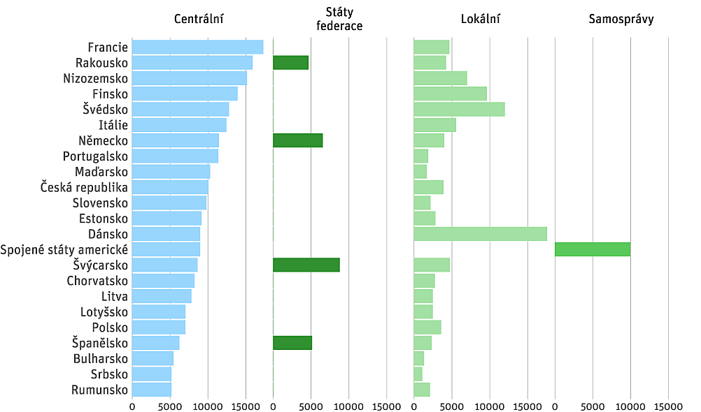

```{r setup, include=FALSE}
options(htmltools.dir.version = FALSE)
knitr::opts_chunk$set(fig.retina = 3, echo = F,
                      cache = F,
                      warning = F,
                      comment = "",
                      dev = "ragg_png",
                      fig.showtext = T,
                      message = F)
library(fontawesome)
library(tidyverse)
library(ptrr)
library(ragg)
library(knitr)

library(xaringanExtra)
library(flipbookr)

ptrr::set_geom_defaults()
ptrr::set_ptrr_ggplot_fonts()
update_geom_defaults("rect", list(fill = "blue"))

options(tibble.print_min = 20)
```

```{r, include=FALSE}
xaringanExtra::use_xaringan_extra("share_again")

xaringanExtra::style_share_again(
  share_buttons = c("twitter", "linkedin", "pocket")
)

xaringanExtra::use_extra_styles(
  hover_code_line = TRUE,         
  mute_unhighlighted_code = TRUE  
)
```


```{r xaringan-themer, include=FALSE, warning=FALSE}
library(xaringanthemer)
style_mono_accent(
  base_color = "#0000ff",
  header_font_google = google_font("IBM Plex Sans"),
  text_font_google   = google_font("IBM Plex Sans"),
  code_font_google   = google_font("IBM Plex Mono"),
  table_row_even_background_color = "fff"
)
```

```{r fonts, include=FALSE}
ptrr::register_plexsans()
ptrr::register_plexsans_condensed()
```

```{r meta, include=FALSE}
library(metathis)
meta() %>%
  meta_general(
    description = "Description",
    generator = "xaringan and remark.js"
  ) %>% 
  meta_name("github-repo" = "petrbouchal/ies2021") %>% 
  meta_social(
    title = "Title",
    url = "https://petrbouchal.xyz/ies2021",
    image = "https://petrbouchal.xyz/ies2021/twitter_card.png",
    image_alt = "social alt",
    og_type = "website",
    og_locale = "cs_CZ",
    og_author = "Petr Bouchal",
    twitter_card_type = "summary_large_image",
    twitter_creator = "@petrbouchal"
  ) %>% 
  write_meta("meta.html")
```

class: large, left, middle, inverse

# Why should we care about budgets?

---
class: left, top, large

0. What is a budget good for? (Concepts)

--
 
1. How do we understand public money? (Data)

--
 
2. Where does public money come from? (Revenue)

--
 
3. How is public money spent? By whom? (Spending)

--

4. Why is that so? (Political economy)

--

5. How is public money managed? (Rules, institutions)

--

---
class: large, inverse, middle

# What is a budget?

---
class: large


A plan

An expression of collective decisions

A solution to collective action problems

An accountability tool

---
class: inverse, middle


# What else can we know about public money

---
class: large

# Think stocks and flows

Budgets v. P&L x balance sheets

= What is raised/spent v. what is owned and owed

---
class: large

# Think principals and agents: who accounts to whom

Spenders to finance ministry

Executive to legislature

Supreme Audit Institutions

Member states <-> EU

---
class: large

# Think ex ante and ex post accountability

budgets as plans vs. accounts as records of what happened

Accounting and economics concepts/language can clash

Accountability => data is generated!

---
class: inverse, middle

# Where does money come from

---

![]

---

## Income by level of government



---

## Sources of income by region (CZ)


---


---

class: inverse, bottom, right, large
layout: false

<a href="https://twitter.com/petrbouchal">`r fa("twitter", fill = "white")`</a> <a href="https://github.com/petrbouchal">`r fa("github", fill = "white")`</a> <a href="https://linkedin.com/in/petrbouchal">`r fa("linkedin", fill = "white")`</a> petrbouchal  
[petrbouchal.xyz](https://petrbouchal.xyz)  
pbouchal@gmail.com


