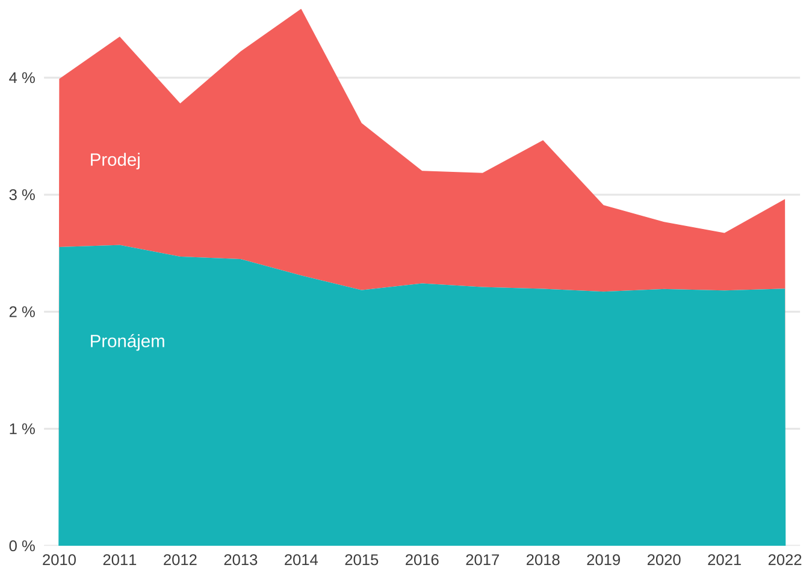
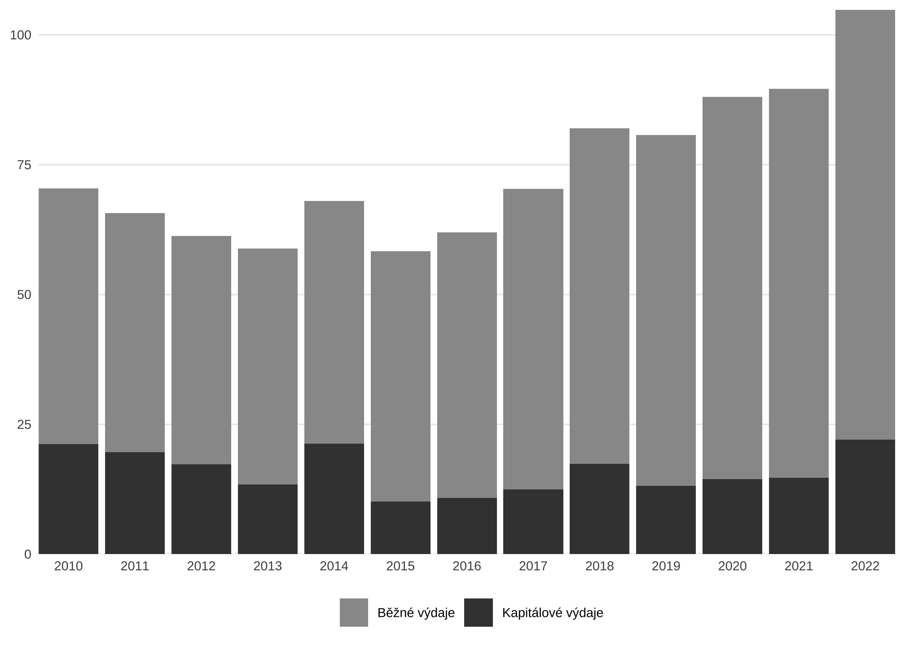

```{r setup, include=FALSE}
options(htmltools.dir.version = FALSE)
knitr::opts_chunk$set(fig.retina = 3, echo = F,
                      cache = F,
                      warning = F,
                      comment = "",
                      dev = "ragg_png",
                      fig.showtext = T,
                      message = F)
library(fontawesome)
library(tidyverse)
library(ptrr)
library(ragg)
library(knitr)

library(xaringanExtra)
library(flipbookr)

ptrr::set_geom_defaults()
ptrr::set_ptrr_ggplot_fonts()
update_geom_defaults("rect", list(fill = "blue"))

options(tibble.print_min = 20)
```

```{r, include=FALSE}
xaringanExtra::use_xaringan_extra("share_again")

xaringanExtra::style_share_again(
  share_buttons = c("twitter", "linkedin", "pocket")
)

xaringanExtra::use_extra_styles(
  hover_code_line = TRUE,         
  mute_unhighlighted_code = TRUE  
)
```


```{r xaringan-themer, include=FALSE, warning=FALSE}
library(xaringanthemer)
style_mono_accent(
  base_color = "#0000ff",
  header_font_google = google_font("IBM Plex Sans"),
  text_font_google   = google_font("IBM Plex Sans"),
  code_font_google   = google_font("IBM Plex Mono"),
  table_row_even_background_color = "fff"
)
```

```{r fonts, include=FALSE, eval = FALSE}
ptrr::register_plexsans()
ptrr::register_plexsans_condensed()
```

```{r meta, include=FALSE}
library(metathis)
meta() %>%
  meta_general(
    description = "IES Public Economics BA course: Guest Lecture on Public Budgeting 2022",
    generator = "xaringan and remark.js"
  ) %>% 
  meta_name("github-repo" = "petrbouchal/ies2022") %>% 
  meta_social(
    title = "IES Public Economics BA course: Guest Lecture on Public Budgeting 2022",
    url = "https://petrbouchal.xyz/ies2022",
    image = "https://petrbouchal.xyz/ies2022/twitter_card.png",
    image_alt = "social alt",
    og_type = "website",
    og_locale = "cs_CZ",
    og_author = "Petr Bouchal",
    twitter_card_type = "summary_large_image",
    twitter_creator = "@petrbouchal"
  ) %>% 
  write_meta("meta.html")
```

class: large, inverse

# This lecture

Motivation

Concepts

Data ↔ Examples ↔ Empirical questions

*Examples are micro- & local-level but hopefully stimulate and illustrate*

---
class: large, inverse, middle

# What words come to mind when you hear "public budgeting"?


---
class: large, inverse, middle

# Key takeaways

---
class: large, inverse, center, middle

What use are budgets and accounts

Public money = not just cash flowing

More budgets than just the central state's

Data offers multiple ways of looking at public money

---
class: large, left, middle, inverse

# Why care about budgets?

---
class: left, top, large

0. What is a budget good for? (Concepts)

--
 
1. How do we understand public money? (Data)

--
 
2. Where does public money come from? (Revenue)

--
 
3. How is public money spent? By whom? (Spending)

--

4. Why is that so? (Political Economy)

--

5. How is public money managed? (Rules, Inst'ns)

--

---
class: large, inverse, middle

# What is a budget?

---
class: large, middle


A plan

--

An expression of collective decisions

--

A solution to collective action problems

--

An accountability tool

--

???

Someone writes the plan, someone has influence over it

Collective decisions: both between institutions, between state and society, and between groups of citizens/voters (=> intergenerational and other equity and distributional effects)

Collective action problems: public money = common pool resource

Acctounability for following the plan

---
class: inverse, middle


# What else can we know about public money?

---
class: large

# Think *stocks and flows*

.center[.middle[
Budgets / P&L × balance sheets

= What is raised/spent × what is owned and owed

*Reflected in different data published*
]]

---
class: large

# Think *principals and agents*: who accounts to whom

Spenders (public orgs) → finance ministry

Executive → legislature (Supreme Audit Institutions)

Member states ↔︎ EU

State → voters?

???

Related information asymmetries and attempts to alleviate them

The data you see is often a by-product of these processes

---
class: large

# Think *ex ante* and *ex post* accountability

Budgets as plans × accounts as records of what happened

Accounting and economics concepts/language can clash

Accountability → data is generated!

???

Data often a reflection of budgeting and accounting processes

To work with some parts of it, you need some familiarity with accounting concepts and with the rules around budgeting and accounting in the public sector

---
class: large, inverse, middle

# What empirical questions would you find it interesting to answer?

---
class: inverse, middle

# Where does money come from?

---
class: large, middle

Money = what we get each year? Or: what we own?

Tax or another means? 

What kind of tax?

Who pays it?

Who collects it? Who sets the rates? (tax autonomy?)

Who gets to spend it?

???

- Tax or something else: some revenue sources are similar to tax (insurance, fees etc.)
- Using own assets (property, investments) to generate income
- Tax on what? Wealth x income x consumption => efficiency and equity consequences

---

class: middle

## Aside: credits and data sources

Data: 

- [Státní pokladna MF ČR (State Treasury)](https://monitor.statnipokladna.cz/) via own [R package](https://petrbouchal.xyz/statnipokladna/) combined with [CZSO data](https://www.czso.cz/csu/czso/otevrena_data) via own [R package](https://petrbouchal.xyz/czso/)
- [WOFI SNG database](http://www.sng-wofi.org/data/) via [OECD R package](https://cran.r-project.org/web/packages/OECD/index.html). 2019 data used here, 2022 available from OECD.

Analysis:

- mostly own/colleagues at IPR Praha (publication in [CZ](http://www.iprpraha.cz/uploads/assets/dokumenty/chude_mesto_prazske.pdf) and [EN](http://www.iprpraha.cz/uploads/assets/dokumenty/ssp/analyzy/ekonomika/chude%20mesto%20aj/ipr_chude_mesto_prazske_sazba_en.pdf))
- with Petr Janský, [work on local budgets in COVID-19](https://obce-covid19.netlify.app/)

Apologies for Czech/inadequate labels; will try to explain as I go.

---
## Who gets to spend it: income by level of gov't


.small[source: IPR Praha calculations based on SNG/WOFI database]

???

See variation in extent of public spending

Fiscal federalism != actual political federalism: large variation in role of local spending even in unitary states (Denmark...)

---

## Where money comes from: sources of income by region (CZ)


??? 

One chart exposing multiple issues of budgeting in the modern state

A version of fiscal federalism
Spatial and socioeconomic patterns
Own resources x what a city/region can raise
Automatic transfers (share of tax) vs. subsidies to regions
Subsidies from state can come with strings (current/investment)
Only small share of wealth tax, and smaller in Prague => distributive and efficiency issues

---

## Property income = sell vs. maintain an asset



???

Lesson = top-level budgets can hide detail. It can look good that a budget contains a lot of "own-source" income - but are we selling things, or using our assets to generate sustainable income? Very different long-term consequences

Highlights link between asset income and investment/maintenance cost

---

## What kind of tax? (Local income)


???

Surprising variation: large property taxes in France and US

Czechia way down there

---

## Impact of shocks


---
class: inverse, middle

# How is public money spent?

---
class: middle, large

By whom?

Capital vs. current?

Own activity vs. outsourced?

Where?

In what sector?

---
class: large

## Capital spending by level of govt


---
class: large

## Capital spending → assets


???

Again, linkage between stocks and flows

Invest => own an asset => generate income & maintenance cost

One of the hardest practical questions in managing public money
- account for future income and cost
- have processes for linking stocks and flows, not planning just cash

---
class: inverse, middle

# How is public money managed?

---
class: large, middle

## “The *administrative economy* of public spending”

The *political* problem: how not to spend too much / spend wisely

×

the *administrative* problem of (not) implementing spending plans properly

Institutions, rules, incentives

---

## Investment funding over ...? (Prague)



???

A large chunk of investment spending even in a rich city funded by EU

This money has its own cycles

Election cycles visible in overall spending - different for EU and Prague money

Very little state money subsidising Prague investments - less than in other regions. Could compare with benefit? Tells you st about the financial relationships between the different levels of govt

---

## Implementation gap (Prague)


???

tl;dr:

- spending plans get revised upwards but then not even the initial plan is spent. 

- the problem is bigger for investment
- similar patterns at national level

Highlights issue of practical implementation: budgeting is meaningless if we cannot actually execute on plans

This is not just because of admin capacity - also incentives

---
class: large, middle

 → Public Financial Management

- how to achieve efficiency?
- how to run budgeting as a planning process?
- how to budget for results? (link spending to policy outcomes)
- how to understand impacts (and on whom)


---
class: large, inverse, middle

# How to get and use the data

If you like lots of data and work in R...

---
class: medium

## {statnipokladna}

On CRAN. Documentation at [petrbouchal.github.io/statnipokladna](https://petrbouchal.github.io/statnipokladna) also explains how to use and understand the data.


Provides data published at [monitor.statnipokladna.cz/](https://monitor.statnipokladna.cz/).

---
class: medium

## Also useful

[](https://petrbouchal.xyz/czso)
[](https://petrbouchal.xyz/vsezved)
[](https://petrbouchal.xyz/ispv)

Czech statistical data // school register // jobs & pay data

{[CzechData](https://jancaha.github.io/CzechData/)}
{[RCzechia](https://cran.r-project.org/package=RCzechia)} for Czech geospatial data and metadata, also geocoding

{[eurostat](https://cran.r-project.org/package=eurostat)}
{[wbstats](gshs-ornl.github.io/wbstats/)}
{[oecd](https://cran.r-project.org/package=OECD)} for accessing data from these orgs

---

class: inverse, bottom, right, large
layout: false

.left[[petrbouchal.xyz/ies2022](https://petrbouchal.xyz/ies2021)]

<a href="https://twitter.com/petrbouchal">`r fa("twitter", fill = "white")`</a> <a href="https://github.com/petrbouchal">`r fa("github", fill = "white")`</a> <a href="https://linkedin.com/in/petrbouchal">`r fa("linkedin", fill = "white")`</a> petrbouchal  
[petrbouchal.xyz](https://petrbouchal.xyz)  
pbouchal@gmail.com


